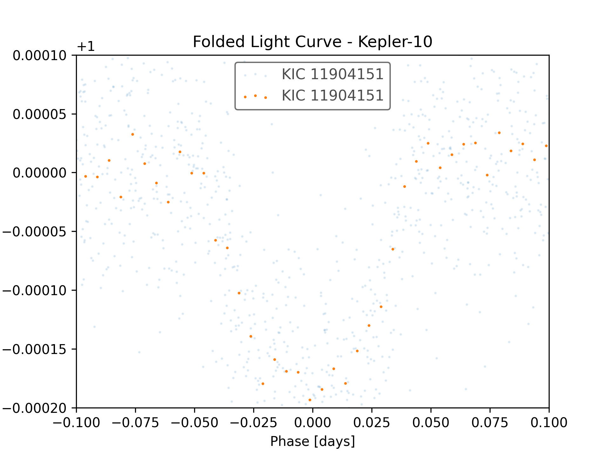

# Exoplanet Transit Detector
Python tool for detecting exoplanet transits in stellar light curve data and estimating planetary parameters.

## Overview

This project analyzes stellar light curves to identify periodic dips in brightness caused by transiting exoplanets. The program applies transit detection techniques to estimate key planetary parameters such as orbital period, planetary radius, and equilibrium temperature.

The code is designed to work with photometric light curve data from space missions such as the Kepler Space Telescope or TESS, but can be applied to any stellar brightness time series.

## Features
- Transit detection
- Orbital period estimation
- Planet radius estimation
• Orbital distance estimation
• Planet equilibrium temperature estimation

## Usage
Run the program with:

```
python exoplanet.py
```

### Example Output

<p align="center">  </p>

```
Detected period: 0.84 days
Transit depth: 0.00018
```
